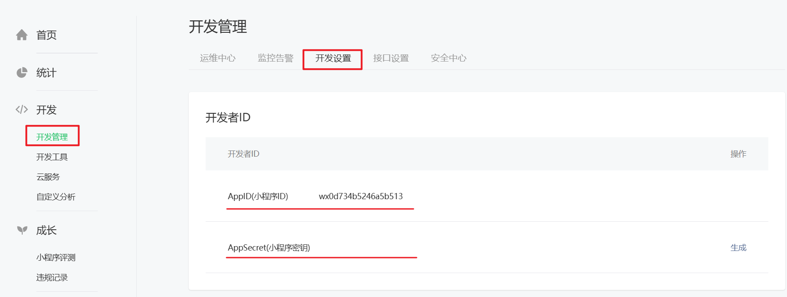

import Tabs from '@theme/Tabs';
import TabItem from '@theme/TabItem';

# 小程序准备工作

## 注册微信小程序账号

在开发微信小程序之前，需要访问 [**微信公众平台**](https://mp.weixin.qq.com/)，注册一个微信小程序账号。

以下列出关键步骤。

import sign from './images/立即注册.png';
import type from './images/选择类型.png';
import checkIn from './images/信息登记.png';
import subject from './images/主体信息登记.png';
import backend from './images/小程序后台.png';

<Tabs>
  <TabItem value="sign" label="立即注册" default>
    
  </TabItem>
  <TabItem value="type" label="选择类型">
    
  </TabItem>
  <TabItem value="checkIn" label="信息登记">
    <p>主体类型选择个人，其他类型需要资质认证。</p>
    
  </TabItem>
  <TabItem value="subject" label="主体信息登记">
    <p>将项目 owner 认证为管理员，方便以后对小程序进行开发、成员等的相关设置。</p>
    
  </TabItem>
  <TabItem value="backend" label="小程序后台">
    
  </TabItem>
</Tabs>

## 完善小程序账号信息

小程序账号注册完成后，需要继续补充小程序的基本信息，如名称、图标、描述等，这是后期小程序提交审核时所必需的。

以下是关键步骤。

import improve from './images/完善小程序信息.png';
import category from './images/添加类目.png';
import warning from './images/类目选择注意事项.png';

<Tabs>
  <TabItem value="improve" label="完善小程序信息" default>
    
  </TabItem>
  <TabItem value="category" label="添加类目" default>
    
  </TabItem>
  <TabItem value="warning" label="类目选择注意事项" default>
    <p>选择类目时，不要选择游戏类型，否则微信官方将会视为小游戏开发。</p>
    
  </TabItem>
</Tabs>

:::tip
若后续要修改小程序信息，可在小程序管理后台“设置”中进行修改。
:::

## 小程序开发者 ID

一个完整的开发者 ID 由 **小程序 ID（AppID）** 和 **小程序密钥（AppSecret）** 组成。

- AppId 是小程序在整个微信账号体系内的唯一身份凭证，在新建小程序项目、发布小程序等操作时会用到。
- AppSecret 是开发者对小程序拥有所有权的凭证，在进行微信登录、微信支付，或发送消息等高级操作时会用到。

在小程序管理后台，可以获取到 AppID 和 AppSecret。



## 项目成员和体验成员

- 项目成员：参与小程序开发、运营、数据分析的成员，可登陆小程序管理后台。管理员可在“成员管理”中添加、删除项目成员，并设置项目成员的角色。
- 体验成员：参与小程序内测的成员，可使用体验版小程序，但不属于项目成员。管理员及项目成员均可添加、删除体验成员。


## 小程序项目基本介绍

[微信开发者工具](https://developers.weixin.qq.com/miniprogram/dev/devtools/download.html)

### 创建小程序项目

创建小程序项目时，要选择一个空目录作为小程序的目录。


### 小程序目录结构和文件

主体文件（全局文件）：作用于整个小程序，影响到小程序的每个页面，主体文件必须放在项目的根目录下。

|   文件名    |    作用    | 是否必须 |
|:--------:|:--------:|:----:|
|  app.js  | 小程序入口文件  |  必须  |
| app.json | 小程序的全局配置 |  必须  |
| app.wxss | 小程序的全局样式 | 非必须  |

页面文件：都放在 pages 目录下，一个页面放一个文件夹，每个页面通常由四个文件组成，每个文件只对当前页面生效。

|  文件名  |  作用  | 是否必须 |
|:-----:|:----:|:----:|
|  .js  | 页面逻辑 |  必须  |
| .wxml | 页面结构 |  必须  |
| .wxss | 页面样式 | 非必须  |
| .json | 页面配置 | 非必须  |

:::tip
- 页面的 `.wxss`、`.json` 文件能够覆盖主体文件中的样式和配置。
- 强烈建议：页面文件夹名称和页面文件名称要保持一致。
:::

```text
├─pages	             ➡ 小程序页面目录
│  ├─index           ➡ index 文件夹代表是 index 页面所需的文件
│  │  index.js
│  │  index.json
│  │  index.wxml
│  │  index.wxss
│  .eslintrc.js      ➡ ESLint 配置
│  app.js
│  app.json
│  app.wxss
│  project.config.json         ➡ 小程序开发者工具公共配置
│  project.private.config.json ➡ 小程序开发者工具私有配置
│  sitemap.json                ➡ 小程序搜索优化（SEO）配置
```

### 调试小程序

:::warning
微信开发者工具缓存非常严重！如果发现代码和预期不一样，要清除缓存甚至重启项目，再编译！
:::

### 新建页面

:::tip
- 使用微信开发者工具右键新建页面，会自动在 app.json 的 `pages` 选项中新增页面路径。
- 在 app.json 的 `pages` 中直接新增页面路径，也会自动在 pages 目录下生成页面文件。
:::

### 调试基础库

基础库是小程序的运行环境，给小程序提供了运行所需的各种 API 和工具，以及基础框架和运行逻辑等。

可以在微信开发者工具中选择基础库版本，作为运行和调试小程序时的运行环境。

每个小程序都有基础库最低版本要求，开发者可以选择要兼容的基础库版本，从而确保小程序的功能正常运行。


