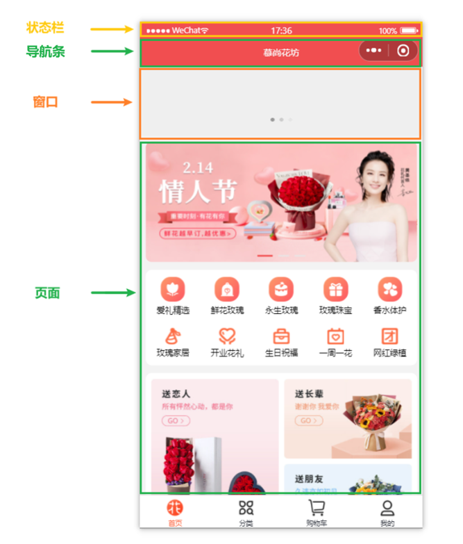
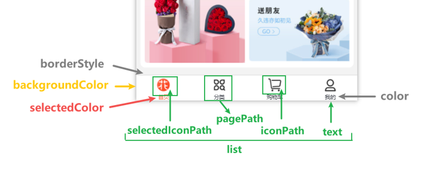
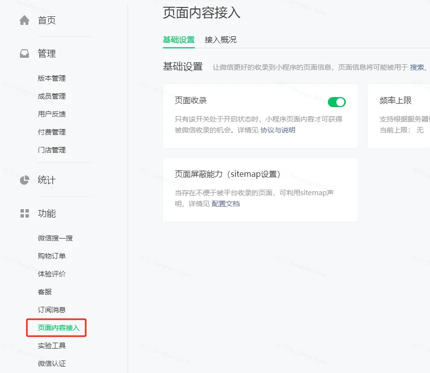

# 小程序配置

## 全局配置

app.json 是小程序的全局配置文件，用于配置小程序的全局属性、页面路由、tabBar 等。

小程序启动时，会读取 app.json 中的配置，根据配置生成对应的页面和组件、界面表现、网络超时时间、底部 tabBar 等，在小程序运行过程中起着关键作用。

### entryPagePath

`entryPagePath` 用于指定小程序的默认启动路径（首页）。

```json title="app.json"
{
  "entryPagePath": "pages/logs/logs"
}
```

### pages

`pages` 用于指定小程序由哪些页面组成（页面路由）。

```json title="app.json"
{
  "pages": [
    "pages/index/index",
    "pages/list/list"
  ]
}
```

:::tip
- 页面路由不需要写文件后缀，框架会自动去寻找对应的 `.json`、`.js`、`.wxml`、`.wxss` 四个文件进行处理。
- 小程序中新增/减少页面，都需要对 `pages` 数组进行修改。
- 未指定 `entryPagePath` 时，数组的第一项代表小程序的初始页面（首页）。
:::

### window

`window` 用于配置小程序的状态栏、导航条、标题、窗口背景色等。



```json title="app.json"
{
  "window": {
    "backgroundTextStyle": "light",
    "backgroundColor": "#eee",
    "navigationBarBackgroundColor": "#f3514f",
    "navigationBarTitleText": "慕尚花坊",
    "navigationBarTextStyle": "white",
    "enablePullDownRefresh": true
  }
}
```

### tabBar

`tabBar` 用于定义小程序顶部、底部 tab 栏。

如果小程序是一个多 tab 应用（例如在小程序底部或顶部通过 tab 栏切换页面），也可以通过 `tabBar` 配置项指定 tab 栏的表现，以及 tab 切换时显示的对应页面。



`tabBar` 中的 `list` 是一个数组，用于对每个 tab 进行配置。

:::tip
- 只能配置最少 2 个，最多 5 个 tab。
- 当 tabBar 位于顶部时，不显示 icon。
:::

```json title="app.json"
{
  "tabBar": {
    "color": "#252933",
    "selectedColor": "#FF734C",
    "backgroundColor": "#ffffff",
    "borderStyle": "black",
    "list": [
      {
        "text": "首页",
        "iconPath": "/assets/tabbar/home.png",
        "selectedIconPath": "/assets/tabbar/home-active.png",
        "pagePath": "pages/home/home"
      },
      {
        "text": "列表",
        "iconPath": "/assets/tabbar/list.png",
        "selectedIconPath": "/assets/tabbar/list-active.png",
        "pagePath": "pages/list/list"
      },
      {
        "text": "购物车",
        "iconPath": "/assets/tabbar/cart.png",
        "selectedIconPath": "/assets/tabbar/cart-active.png",
        "pagePath": "pages/cart/cart"
      },
      {
        "text": "我的",
        "iconPath": "/assets/tabbar/my.png",
        "selectedIconPath": "/assets/tabbar/my-active.png",
        "pagePath": "pages/my/my"
      }
    ]
  }
}
```

## 页面配置

页面目录中的 .json 文件用于配置当前页面的窗口样式、页面标题等。

页面配置文件（.json）中的属性和全局配置文件中的 window 属性几乎一致，但页面配置文件中不需要指定 window 字段。

如果页面配置与全局配置出现相同的配置项，页面配置会覆盖全局配置。

```json title="页面.json"
{
  "usingComponents": {},
  "navigationBarTitleText": "商品分类",
  "navigationBarTextStyle": "white",
  "navigationBarBackgroundColor": "#00AF92",
  "enablePullDownRefresh": true,
  "backgroundColor": "#eee",
  "backgroundTextStyle": "light"
}
```

## 项目配置

project.config.json 是项目的公共配置文件，通过微信开发者工具对项目做的配置，都会写入到这个文件。当其他人打开项目，微信开发者工具也会读取并应用 project.config.json 中的配置。

project.private.config.json 是开发者个人私有配置，它的优先级高于 project.config.json。

:::warning
- 应该将 project.private.config.json 写到 .gitignore 中，避免与其他开发者造成冲突。
- 与项目编译结果有关的配置，必须设置到 project.config.json 中，防止编译结果产生差异。
:::

## 使用 Sass/Less/TS

要使用 Sass 或 Less 开发小程序，就需要将 Sass 或 Less 编译成 wxss。

在 project.config.json 中，修改 `setting` 下的 `useCompilerPlugins` 字段为 ["sass"]，即可开启工具内置的 sass 编译插件。

```json title="project.config.json"
{
  "setting": {
    "useCompilerPlugins": [
      "sass"
    ]
  }
}
```

配置好以后，需要将 `.wxss` 后缀改成 `.scss`。

如需同时开启 TS 编译插件，可将该字段修改为 ["typescript", "sass"]。目前支持三个编译插件：typescript、less、sass。

## sitemap.json

微信可以通过爬虫的方式，爬取小程序页面，为小程序页面内容建立索引。当用户的搜索词条触发该索引时，小程序的页面可能会被推荐到搜索结果中。

sitemap.json 用于配置小程序页面是否允许被微信索引，或配置哪些页面允许/不允许被索引。

小程序默认所有页面都允许被索引。

```json title="sitemap.json"
{
  "rules": [
    {
      "action": "allow",
      "page": "*"
    }
  ]
}
```

只允许 pages/index/index 页面被索引，其他页面都不能被索引。

```json title="sitemap.json"
{
  "rules":[
    {
      "action": "allow",
      "page": "pages/index/index"
    }
  ]
}
```

配置 pages/index/index 页面不允许被索引，而其他页面允许被索引。

```json
{
  "rules":[
    {
      "action": "disallow",
      "page": "pages/index/index"
    }
  ]
}
```

:::tip
sitemap.json 文件不是必需的，如果没有 sitemap.json，则默认所有页面都能被索引。
:::

在小程序管理后台，也可以通过“页面收录”开关来配置小程序页面能否被索引。



## 渲染模式

小程序有两种渲染模式：Skyline 和 WebView。

Skyline 是最新的渲染模式，目前不是很成熟。如果要使用 WebView 渲染模式，需要将 app.json 中的 `renderer`、`rendererOptions`、`componentFramework` 三个配置项去掉。
